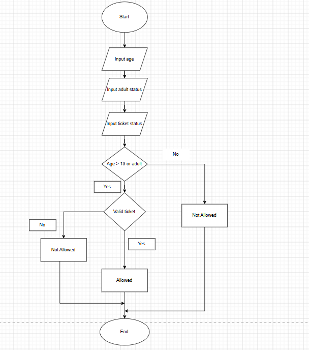

## Identify the Components

### Inputs

The inputs for the movie theater admission system are:

1. Input - User's age >= 13 OR accompanied by adult AND valid ticket
2. Process - Whether the user is accompanied by an adult and valid ticket (Yes/No)
3. Output - Allowed to enter

## Truth Table

| Age ≥ 13 | Accompanied by Adult | Valid Ticket | Allowed |
|-----------|---------------------|--------------|---------|
| False | False | False | False |
| False | False | True | False |
| False | True | False | False |
| False | True | True | True |
| True | False | False | False |
| True | False | True | True |
| True | True | False | False |
| True | True | True | True |

---

## Algorithm

---

## Pseudocode

```text
START

INPUT age
INPUT accompaniedbyadult
INPUT validticket

IF ((age >= 13 OR accompaniedbyadult) AND validticket) THEN
    DISPLAY "Allowed to enter"
ELSE
    DISPLAY "Not allowed to enter"
END IF

END
```

---

## Evaluate Expression 
``` Input
Age : 12
Adult : Yes
Ticket : Yes
```
``` Output 
Allowed 
```
``` Input
Age : 15
Adult : No
Ticket : No
```
``` Output
Allowed not enter
```