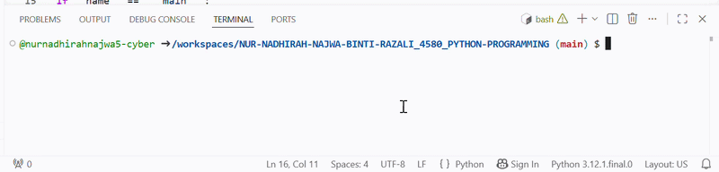

# Food Delivery System

## Purpose
This program generates a receipt for customer food orders.

## Tech Stack
- Python 3

## Files
- main.py
- customer.py
- receipt.py

## How to Run
1. Open the project folder.
2. Run:
   python main.py
3. Enter customer information.
4. The program displays the receipt.

## Application Demonstration

