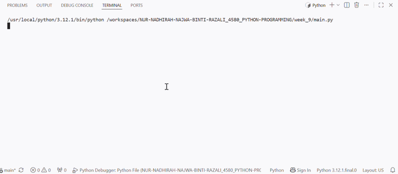

# IT Helpdesk Ticket Registration System

## Purpose
This program is used to register IT helpdesk tickets submitted by student

## Tech Stack
- Python 3

## Files
- main.py
- ticket.py
- display.py

## How to Run
1. Open the project folder.
2. Run:
   python main.py
3. Enter student information.
4. The program displays the receipt.

## Application Demonstration
